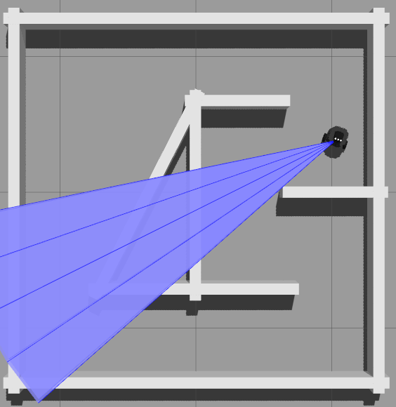

# turtlebot ultrasonic demo

This repository contains the contents for a turtlebot ultrasonic demonstration.

It is running Gazebo, RVIZ and some other ROS nodes.



## Requeriments

This demo has been tested on Ubuntu Bionic (18.04)

### Dependencies

Install [ROS](http://wiki.ros.org/melodic/Installation/Ubuntu) and some turtlebot packages:

```bash
sudo apt-get install ros-melodic-turtlebot3 ros-melodic-turtlebot3-fake ros-melodic-dwa-local-planner
```
### Download the code and compile it

```bash
mkdir -p ~/ros2_ws/src
cd ~/ros2_ws/src
git clone https://github.com/osrf/turtlebot3_ultrasonic_demo
cd ~/ros2_ws/
catkin_make_isolated --install
```

## Running

By default it will launch gazebo and a small python script that will allow the robot to follow the wall.

```bash
cd ~/ros2_ws/
source install_isolated/setup.bash
roslaunch turtlebot3_ultrasonic_demo_launcher turtlebot3_ultrasonic_demo.launch
```
